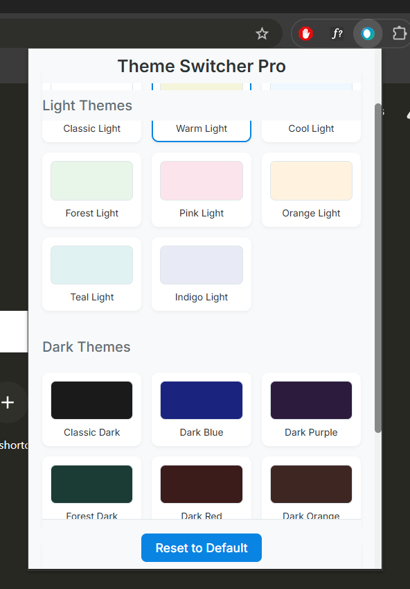

# Theme Switcher Pro - Chrome Extension

A beautiful and professional Chrome extension that allows users to switch between multiple carefully crafted themes for a better browsing experience.



## Features

- 🎨 17 Beautiful Themes
  - 8 Light Themes
  - 9 Dark Themes
- ⚡ One-click Theme Switching
- 🔄 Smooth Transitions
- 💾 Persistent Theme Preferences
- 🎯 Professional UI Design
- 👆 Easy to Use Interface
- 🌐 Works on All Websites
- 🎭 Customizable Elements

## Available Themes

### Light Themes
- Classic Light - Clean and professional
- Warm Light - Cozy and comfortable
- Cool Light - Fresh and modern
- Forest Light - Natural and calming
- Pink Light - Soft and gentle
- Orange Light - Energetic and warm
- Teal Light - Fresh and aquatic
- Indigo Light - Sophisticated and elegant

### Dark Themes
- Classic Dark - Professional dark mode
- Dark Blue - Deep and calming
- Dark Purple - Rich and luxurious
- Forest Dark - Natural dark theme
- Dark Red - Bold and striking
- Dark Orange - Warm dark mode
- Dark Teal - Aquatic dark theme
- Dark Indigo - Professional dark mode
- Dark Cyan - Modern dark theme
- Deep Purple - Luxurious dark mode

## Installation

### From Chrome Web Store
1. Visit the Chrome Web Store
2. Search for "Theme Switcher Pro"
3. Click "Add to Chrome"
4. Click "Add Extension"

### Manual Installation (Developer Mode)
1. Download or clone this repository
2. Open Chrome and go to `chrome://extensions/`
3. Enable "Developer mode" in the top right
4. Click "Load unpacked" and select the extension directory

## Usage

1. Click the Theme Switcher Pro icon in your Chrome toolbar
2. Choose a theme from the available options
3. The theme will be applied immediately to the current page
4. Your theme preference will be saved and applied to new pages
5. Use the "Reset to Default" button to remove the custom theme

## Features in Detail

### Theme Application
- Background colors
- Text colors
- Link colors
- Form elements
- Buttons
- Cards and containers
- Headers and navigation
- Tables
- Lists
- Code blocks
- Images and media
- Scrollbars
- Text selection
- Hover effects

### User Interface
- Clean, modern design
- Visual theme previews
- Smooth hover effects
- Sticky headers for easy navigation
- Responsive grid layout
- Custom scrollbar styling

## Development

### Project Structure
```
Theme Switcher/
├── manifest.json
├── popup.html
├── popup.css
├── popup.js
├── content.js
├── background.js
└── icons/
    ├── icon16.png
    ├── icon48.png
    └── icon128.png
```

### Building from Source
1. Clone the repository
2. Make your modifications
3. Test the extension locally
4. Create a ZIP file of the extension directory
5. Upload to Chrome Web Store Developer Dashboard

## Contributing

Contributions are welcome! Please feel free to submit a Pull Request.

## License

This project is licensed under the MIT License - see the LICENSE file for details.

## Privacy Policy

Theme Switcher Pro does not collect, store, or transmit any personal information or browsing data. The extension only stores your theme preference locally in your browser and applies themes to web pages you visit.

No data is sent to any servers or third parties. Your theme preferences are stored locally in your browser and can be cleared at any time using the "Reset to Default" button.

## Support

If you encounter any issues or have suggestions for improvement, please:
1. Check the existing issues
2. Create a new issue if needed
3. Provide detailed information about the problem

## Acknowledgments

- Icons designed with modern UI principles
- Color schemes carefully selected for optimal readability
- Built with vanilla JavaScript for maximum performance
- Inspired by modern web design trends

## Version History

### v1.0.0
- Initial release
- 17 beautiful themes
- Complete theme switching functionality
- Professional UI design

## Future Updates

- More theme options
- Custom theme creation
- Theme scheduling
- Website-specific themes
- Keyboard shortcuts
- Theme categories
- Theme ratings and favorites

## Credits

Created with ❤️ by [Your Name]

---

Made with modern web technologies and a focus on user experience. 